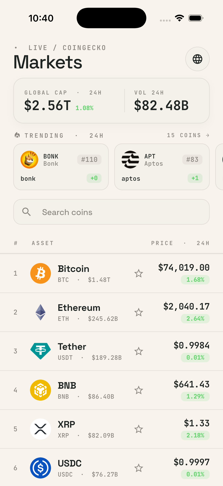
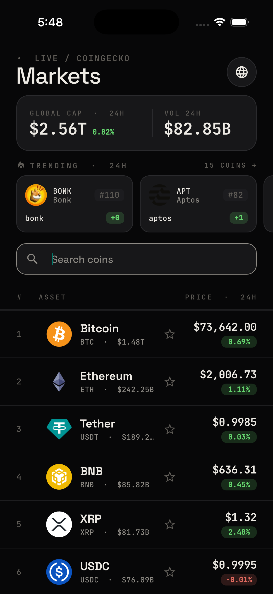
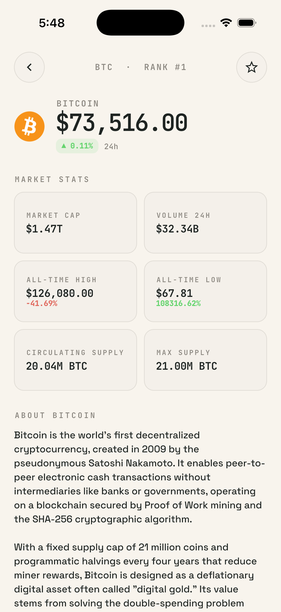
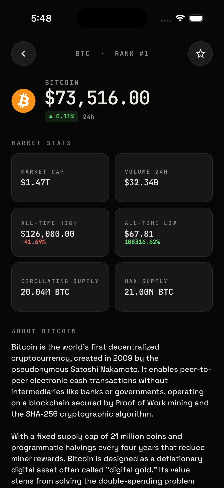
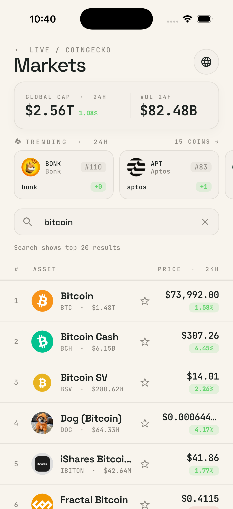
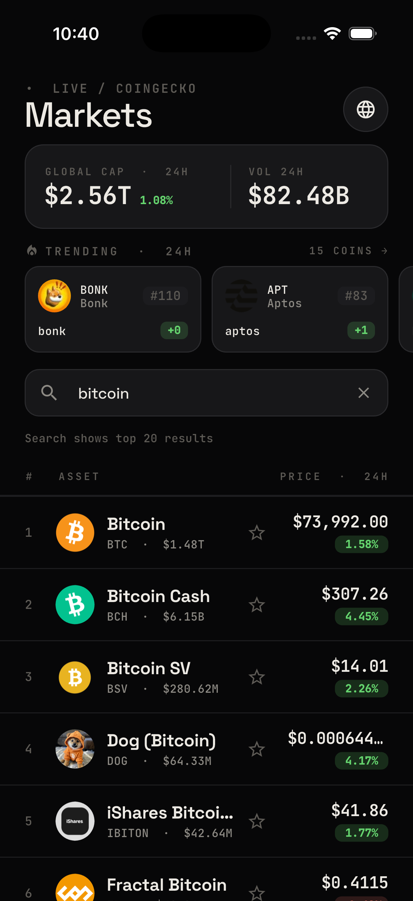
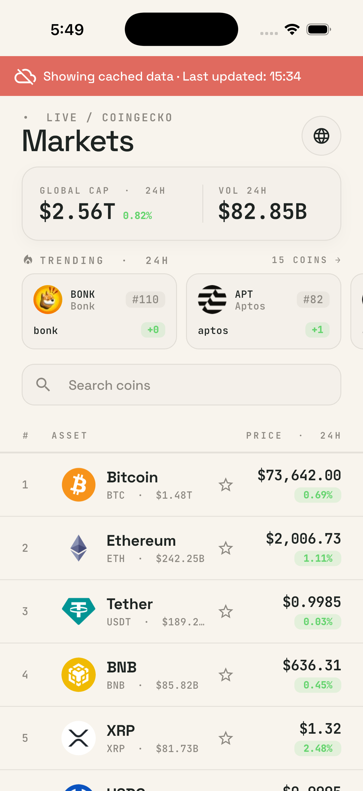
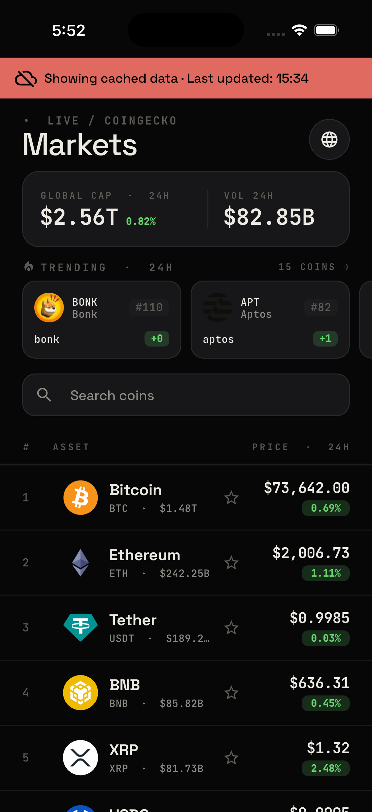
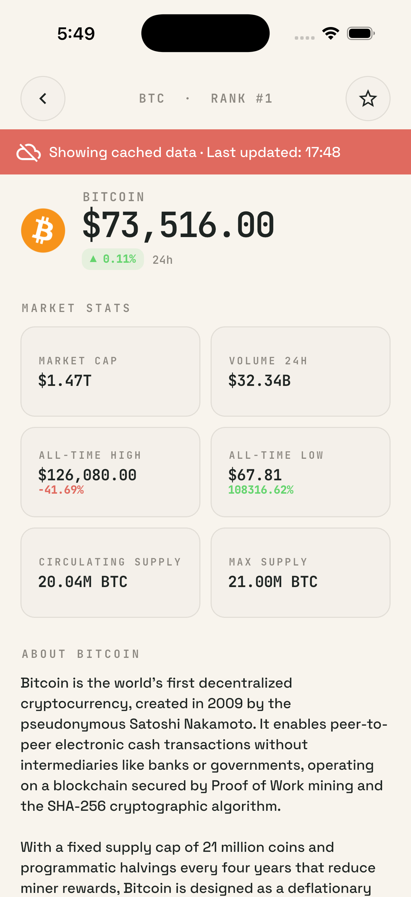
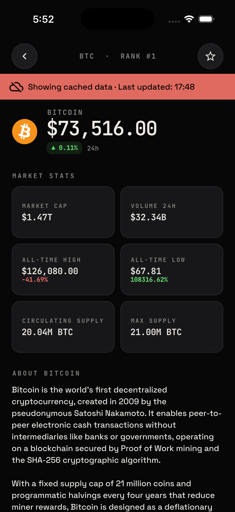

# Crypto Tracker App

A production-oriented Flutter take-home assignment for tracking cryptocurrency markets using the CoinGecko Free API.

The app is built with Clean Architecture, MVVM using BLoC-backed ViewModels, Hive local persistence, offline cache fallback, favorites, system theme support, English/Myanmar language switching, automated tests, and GitHub Actions CI/CD.

## Features

* Global market cap and 24h volume summary
* Trending coins from CoinGecko
* Paginated cryptocurrency market list with infinite scroll
* Search by coin name/symbol
* Coin detail screen with rank, price, 24h change, market cap, volume, ATH, ATL, circulating supply, max supply, description, and source link
* Mark/unmark favorites with Hive persistence
* Pull to refresh
* Cached offline responses for markets, trending coins, global market, and coin detail
* Loading, error, empty, and offline states
* Light/dark theme using `ThemeMode.system`
* English/Myanmar in-app language switching
* GitHub Actions CI/CD with formatting, analysis, tests, coverage, and Android debug build

## Assignment Requirement Mapping

| Requirement                           | Status | Implementation                                        |
| ------------------------------------- | -----: | ----------------------------------------------------- |
| Global market cap                     | ✅ Done | CoinGecko `/global`, global market card               |
| Trending coins                        | ✅ Done | CoinGecko `/search/trending`, horizontal list         |
| Paginated coin list                   | ✅ Done | CoinGecko `/coins/markets`, page-based loading        |
| Infinite scroll                       | ✅ Done | Scroll listener with pagination guard                 |
| Search                                | ✅ Done | `/search` + `/coins/markets?ids=...`                  |
| Coin detail                           | ✅ Done | CoinGecko `/coins/{id}` detail page                   |
| Favorites                             | ✅ Done | Hive local persistence                                |
| Pull to refresh                       | ✅ Done | Reloads list, global market, and trending coins       |
| Loading/error/empty states            | ✅ Done | ViewModel state handling                              |
| Offline support                       | ✅ Done | Hive cache fallback with offline metadata             |
| Dark/light theme                      | ✅ Done | System theme detection                                |
| English/Myanmar switching             | ✅ Done | App localization with persisted locale                |
| MVVM                                  | ✅ Done | BLoC used as ViewModel                                |
| State management                      | ✅ Done | `flutter_bloc`                                        |
| Clean Architecture                    | ✅ Done | Presentation, domain, and data layers                 |
| TDD/BDD                               | ✅ Done | Unit, repository, ViewModel, widget, and golden tests |
| REST API integration                  | ✅ Done | Dio + CoinGecko Free API                              |
| Database/local persistence            | ✅ Done | Hive                                                  |
| Dependency Injection                  | ✅ Done | get_it                                                |
| GitHub Actions CI                     | ✅ Done | Format, analyze, test, Android build                  |
| README setup + architecture decisions | ✅ Done | This document + `ARCHITECTURE.md`                     |

## Screenshots

### Coin List

| Light Mode                                            | Dark Mode                                           |
| ----------------------------------------------------- | --------------------------------------------------- |
|  |  |

### Coin Detail

| Light Mode                                                | Dark Mode                                               |
| --------------------------------------------------------- | ------------------------------------------------------- |
|  |  |

### Search Results

| Light Mode                                                           | Dark Mode                                                          |
| -------------------------------------------------------------------- | ------------------------------------------------------------------ |
|  |  |

### Offline Cache

#### Coin List Offline Cache

| Light Mode                                                                    | Dark Mode                                                                   |
| ----------------------------------------------------------------------------- | --------------------------------------------------------------------------- |
|  |  |

#### Coin Detail Offline Cache

| Light Mode                                                                        | Dark Mode                                                                       |
| --------------------------------------------------------------------------------- | ------------------------------------------------------------------------------- |
|  |  |

## Reviewer Quick Start

```sh
git clone https://github.com/eizinhtun/crypto_tracker_app.git
cd crypto_tracker_app
flutter pub get
flutter test
flutter run
```

For full local verification:

```sh
dart format --output=none --set-exit-if-changed .
flutter analyze --fatal-infos --fatal-warnings
flutter test
flutter build apk --debug
```

## Tech Stack

* Flutter
* `flutter_bloc` as the ViewModel/state-management implementation
* Dio for REST API calls
* Hive for local cache and favorites
* get_it for dependency injection
* go_router for navigation
* Flutter localization delegates with app-owned typed localization access
* bloc_test, mocktail, and flutter_test for tests
* GitHub Actions for CI/CD

## Project Structure

```text
lib/
  core/
    constants/
    database/
    error/
    localization/
    network/
    theme/
    utils/
  features/
    crypto/
      data/
        datasources/
        models/
        repositories/
      domain/
        entities/
        repositories/
        usecases/
      presentation/
        pages/
        viewmodels/
        widgets/
```

## Architecture

The project follows Clean Architecture:

```text
presentation -> domain -> data/core infrastructure
```

* `presentation`: pages, widgets, BLoC-backed ViewModels, events, and states
* `domain`: entities, repository interfaces, and use cases
* `data`: models/DTOs, remote/local data sources, and repository implementation
* `core`: network, errors/results, database, DI, theme, localization, and utilities

Dependency direction is enforced by architecture boundary tests.

The expected flow is:

```text
Page / Widget
↓
BLoC as ViewModel
↓
UseCase
↓
Repository Interface
↓
Repository Implementation
↓
RemoteDataSource + LocalDataSource
↓
Dio + Hive
```

Important boundaries:

* UI does not call Dio or Hive
* ViewModels do not call Dio or Hive
* ViewModels call domain use cases
* Use cases depend on repository interfaces
* Repository implementations coordinate remote and local data sources
* Remote data sources use Dio
* Local data sources use Hive
* The domain layer has no Flutter, Dio, or Hive dependency

For deeper reviewer notes, see [ARCHITECTURE.md](ARCHITECTURE.md).

## MVVM Mapping

```text
View       = Flutter pages and widgets
ViewModel  = BLoC classes in presentation/viewmodels
Model      = Domain entities plus data models/DTOs
```

BLoC is intentionally used as the ViewModel layer. Each ViewModel receives UI events, exposes immutable UI state, calls domain use cases, and maps domain results into renderable loading, success, error, empty, and offline states.

No duplicate ViewModel classes are needed because BLoC already owns presentation state and user-intent handling.

## REST API Strategy

CoinGecko integration is isolated in `CryptoRemoteDataSource` behind `DioClient`.

This project uses the CoinGecko Free API. No API key is required.

Base URL:

```text
https://api.coingecko.com/api/v3/
```

Implemented endpoints:

```text
GET /coins/markets
GET /global
GET /search/trending
GET /coins/{id}
GET /search
```

`DioClient` owns:

* centralized HTTPS base URL
* timeout configuration
* JSON accept headers
* debug-only logging
* bounded retry/backoff for GET requests on 429 and transient server/network failures
* structured error mapping for 400, 401/403, 404, 408/timeouts, 429, 500+, connection errors, and unknown errors

Raw `DioException`, stack traces, and internal API URLs are not exposed directly to UI state.

### Search Strategy

CoinGecko’s `/search` endpoint returns basic coin metadata, but it does not provide complete market row values such as current price, market cap, and 24h percentage change.

To keep search results visually consistent with the main market list, the app uses a two-step search flow:

```text
/search
↓
extract matching coin ids
↓
/coins/markets?ids=...
↓
display complete market rows
```

This costs one extra API call, but it provides a better user experience because search results show the same type of price and market information as the main list.

Search mode intentionally shows the top 20 matched results only. Infinite scroll is disabled during active search and restored after clearing the query.

To reduce unnecessary traffic, the app uses submitted search, query normalization, request sequencing to ignore stale responses, duplicate request protection, and friendly rate-limit handling.

## Security Considerations

* CoinGecko Free API is used without an API key
* No API keys, tokens, or secrets are hardcoded
* API communication uses HTTPS through the centralized CoinGecko base URL
* Dio logging is enabled only in debug mode
* Logging does not expose sensitive headers, tokens, or request bodies
* Network errors are mapped to user-friendly messages
* Raw `DioException` messages are not displayed in the UI
* Hive stores only non-sensitive public market cache and favorite coin IDs
* Duplicate requests are prevented to reduce unnecessary traffic and rate-limit issues
* For production apps with authentication, secure storage and stronger runtime protections would be considered

### Local Storage Security Decision

Hive encryption is not enabled because the app stores only non-sensitive data:

* public cryptocurrency market cache
* public coin detail cache
* favorite coin IDs
* selected locale

No access tokens, API keys, passwords, payment information, or private user data are stored locally.

If this app later included authentication or private user data, encrypted storage or secure storage would be required.

## Offline Cache

Successful API responses are cached in typed Hive records:

* coin market pages
* global market data
* trending coins
* coin detail responses
* favorites in a separate boolean box keyed by coin id
* selected locale

When a remote request fails or the device is offline, the repository returns cached data if available and marks the result as `ResultSource.cache`.

ViewModels translate required list/detail cache into `isOffline` and cached overview fallback into `hasCachedData`, so the UI can show cached-data messaging without incorrectly labeling every optional fallback as offline.

Expired cache is invalidated on normal reads, but stale cache is allowed as an explicit offline/failure fallback.

### Offline Search Limitation

Offline search is limited to cached data. It can search previously loaded/cached market data, but it does not claim to search the full CoinGecko catalog while offline.

This is an intentional take-home tradeoff to keep the app reliable, lightweight, and clear about what data is available without network access.

## Dependency Injection

`get_it` is configured once in `main()` after Hive initialization.

`app_router.dart` acts as the composition boundary for feature ViewModels through `BlocProvider`.

Tests can call `resetDependencies()` to clear GetIt safely.

## Navigation

`go_router` is used for list-to-detail navigation.

The list uses `pushNamed`, so normal back navigation works.

The detail top bar uses `context.pop()` when possible and falls back to `context.goNamed(AppRouteNames.home)` when the detail route is the first page. This prevents popping the last GoRouter page from the stack.

## Theme and Localization

The app uses warm cream light colors and near-black dark colors with theme-aware text, borders, cards, and positive/negative market colors.

The detail page uses:

* custom top row
* large price header
* two-column market stat cards
* uppercase section labels
* premium spacing
* readable positive/negative market indicators

Localization supports English and Myanmar.

User-facing labels for search, retry, no-data, offline, market stats, about, favorites, loading states, and error states are centralized in `core/localization` and mirrored in ARB files. The selected locale is persisted in Hive, so the language choice survives app restart.

Typography is locale-aware:

* English UI text uses a Latin-friendly display style
* Myanmar UI text uses Myanmar-supported font styling
* Prices, ranks, symbols, and market numbers use monospaced styling for a dashboard-like market interface

## Testing Strategy

Tests do not call the real CoinGecko API.

Coverage includes:

* model parsing from CoinGecko JSON
* coin detail parsing for `total_volume.usd`, `ath.usd`, `ath_change_percentage.usd`, `atl.usd`, `atl_change_percentage.usd`, `circulating_supply`, and `max_supply`
* remote datasource success/error parsing with mocked Dio adapter
* 429 rate-limit and 500 server mapping
* repository cache fallback and cache metadata
* Hive cache/favorite persistence
* list/detail ViewModel states
* pagination de-duplication
* search clear behavior
* stale search suppression
* favorite sync after search
* detail retry from first-load failure
* localization fallback
* architecture boundary rules
* widget and golden visual regression coverage

Test names use BDD-style `Given ..., when ..., then ...` phrasing where practical.

### Testing Scope

This take-home project focuses on unit tests, repository tests, ViewModel/BLoC tests, model parsing tests, architecture boundary tests, and focused widget/golden tests.

Full device-level end-to-end coverage is not exhaustive in order to keep the submission lightweight and reliable. The architecture supports adding more integration tests for flows such as search, pagination, favorites, localization, and offline cache behavior.

## CI/CD

GitHub Actions runs on pull requests, pushes to `main`, merge queue events, and manual workflow dispatch.

The CI/CD pipeline validates:

* required project files
* dependency lockfile consistency
* formatting
* strict static analysis
* architecture boundary rules
* forbidden raw `DioException` usage in presentation
* tests with coverage
* Android debug APK build
* coverage artifact upload
* Android APK artifact upload
* dependency review for pull requests

Main checks:

```sh
flutter pub get --enforce-lockfile
dart format --output=none --set-exit-if-changed .
flutter analyze --fatal-infos --fatal-warnings
flutter test --coverage
flutter build apk --debug
```

The web build may be included as an optional CI signal, but the Android debug build is the required release gate for this take-home submission.

## Known Non-Blocking Warnings

Flutter may print non-blocking migration warnings related to iOS CocoaPods/Swift Package Manager or Android Kotlin Gradle Plugin future compatibility.

For this take-home assignment, the app is validated through formatting, static analysis, automated tests, and Android debug build in CI. These warnings do not affect the current app functionality or CI result and are tracked as future migration work.

The iOS CocoaPods/SPM warning is not treated as a blocker for this Android/debug take-home submission unless an iOS build is explicitly required.

## Setup

### Flutter Version

This project was verified with the Flutter version pinned in GitHub Actions.

To check your local version:

```sh
flutter --version
```

If your local version is different, the app should still work on stable Flutter, but using the CI-pinned version is recommended for exact test/golden consistency.

### Install Dependencies

```sh
flutter pub get
```

### Run the App

```sh
flutter run
```

### Run with a Specific Device

```sh
flutter devices
flutter run -d <device_id>
```

## Local Verification

Before submitting, run:

```sh
flutter pub get
dart format --output=none --set-exit-if-changed .
flutter analyze --fatal-infos --fatal-warnings
flutter test
flutter build apk --debug
```

Optional coverage check:

```sh
flutter test --coverage
```

## Latest Local Verification

Before submission, the project was verified with:

* `dart format --output=none --set-exit-if-changed .` — PASS
* `flutter analyze` — PASS
* `flutter test` — PASS, 92 tests
* `flutter build apk --debug` — PASS
* `git status --short` — clean

## Recommended Manual QA

Before final submission, verify:

* app launches successfully
* coin list loads
* global market cap appears
* trending coins appear
* pagination appends new rows without duplicates
* search works and clearing search restores the normal list
* pull-to-refresh reloads the list/overview without duplicating rows
* coin detail opens and back navigation works safely
* favorite/unfavorite persists after app restart
* offline cache appears when network is unavailable
* offline banner appears only when cached data is being shown
* dark/light system theme works
* English/Myanmar language switching works
* user-facing errors are friendly and localized
* no raw technical errors appear in the UI

## Deliverables

* Git repository with source code
* Public GitHub repository for review
* README with setup instructions and architecture decisions
* GitHub Actions CI/CD workflow
* Screenshots
* Automated tests

## Development and Verification Note

AI assistance was used as a technical reviewer and implementation aid.

Final architecture decisions, code changes, and verification were validated through formatting checks, static analysis, automated tests, Android debug build, and CI/CD.
